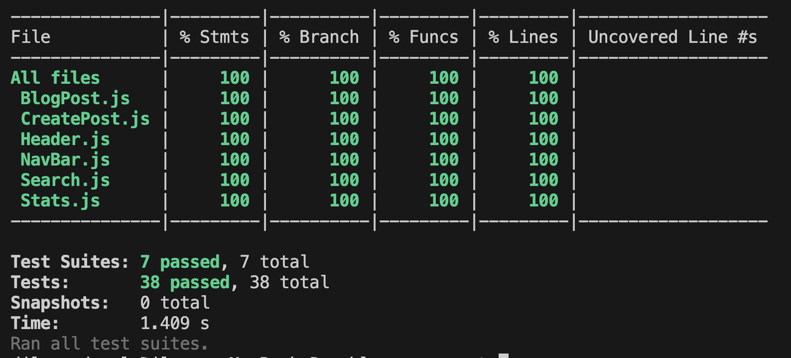
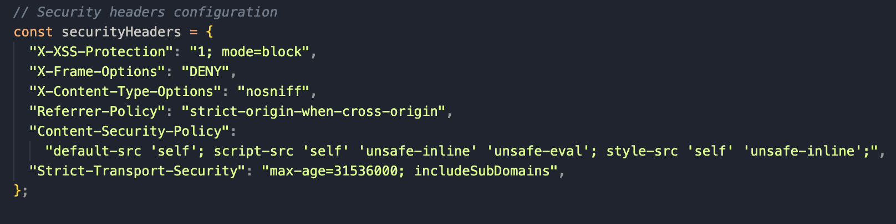
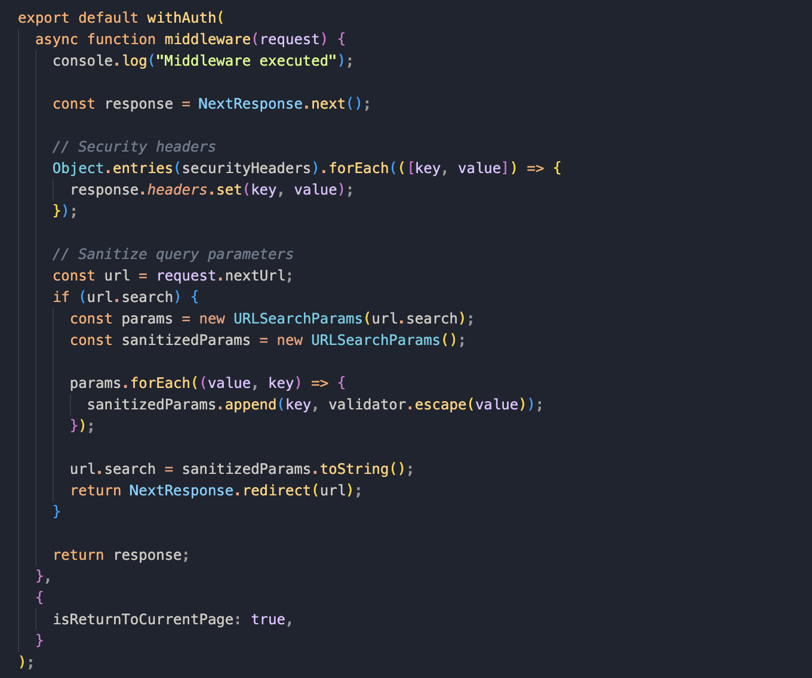
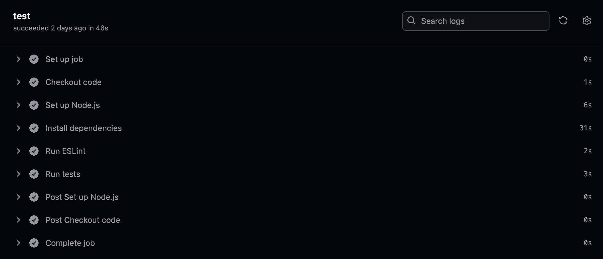
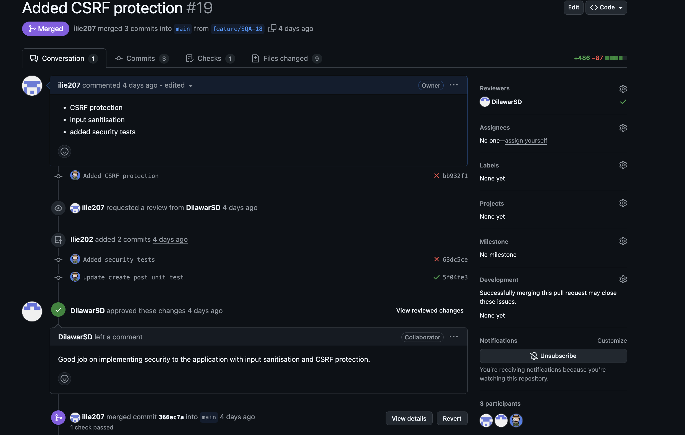
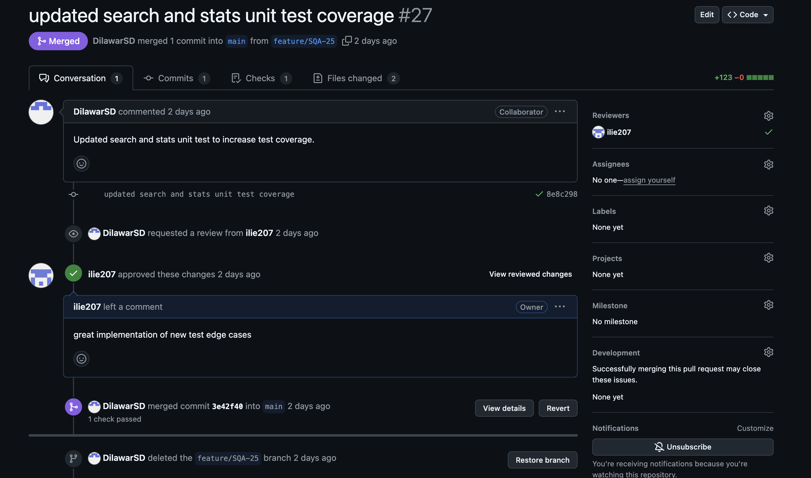
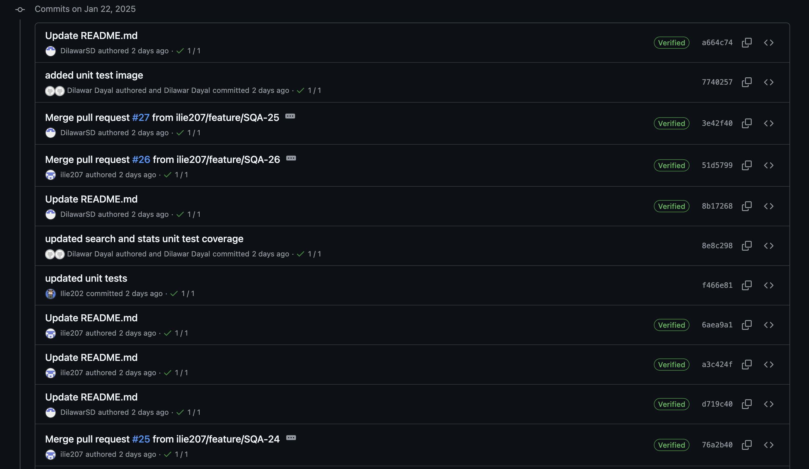

# BlogAppSQA

Simple blog app created with next.js for SQA module assignment

## Team contribution

- Dilawar Singh Dayal- 50%
- Ilie Coroban- 50%

## Set up instructions
**Pre-requisites:** 
1. Create Free [Kinde](https://kinde.com/) account.
2. Create free [Neon](https://neon.tech/?ref=dgys) account.
3. Create a `env.local` file with following values: 
- **#NEON**
- **DATABASE_URL=**ADD_YOUR_NEON_DB_URL

- **#KINDE AUTH**
- **KINDE_CLIENT_ID=**ADD_YOUR_KINDE_ID
- **KINDE_CLIENT_SECRET=**ADD_YOUR_KINDE_SECRET
- **KINDE_ISSUER_URL=**ADD_YOUR_ISSUER_URL
- **KINDE_SITE_URL=**http://localhost:3000
- **KINDE_POST_LOGOUT_REDIRECT_URL=**http://localhost:3000
- **KINDE_POST_LOGIN_REDIRECT_URL=**http://localhost:3000/dashboard

**Terminal commands:**
1. `git clone` repository
2. `cd blog_app_spa`
3. `npm install`
4. `npm run dev`

## Features Implementation Evidence

We have developed this app from scratch using create-next-app provided by the nextjs framework.
Within our SQA app we have developed the following features:

- **User authentication** - We have implemented the authentication feature with the use of [Kinde](https://kinde.com). The implementation required installation of Kinde SDK with the use of npm. After that, we have added the provided environment variables to our local env.local, followed by the addition of KindeAuth in a new route.js file, to establish the connection. With all that complete, we could easily import the already available 'Login' and 'Register' buttons, and everything is handled by them. The authentication method we chose with Kinde was a passwordless register and login. This means that a user could register and login into our app just by entering their email address and the unique code received via email from Kinde.
- **Access control** - We have implemented a fully functional access control feature, which allows the logged in users to edit, delete, and create blog posts. To achive this we have used the Kinde provided data, such as user email, with this we were able to verify the logged in user, and allow them to edit and delete blog posts only if those were created by them.
- **Blog post management** - We have implemented a search component as well as route.js api file, which allows us to query the database with the user search data. We also implemented a sort functionality, this allows users to sort blog posts by latest and by alphabet.

## Testing Evidence

- **Unit and integration testing** - To implement the unit and integration tests we had used jest testing tool. We had used this tool as it is compatible and easy to use with javascript framework like next.js. Jest also includes a test runner, mocking capabilities, this eliminates the need for multiple configurations and librarys. Jest is also well-suited for integration testing and provides excellent choice for testing how components and modules worked together. With the use of this tool we were able to thoroughly test the functionality of our app.
- **Test coverage report**
  

## Challenges and Solutions
**1. Implementation of authentication feature:**
- **Challenge:** It was a challenge to implement the authentication feature using NextJs, as we had to ensure that everything is secure and working as intended.
- **Sollution:** To overcome this challenge and implement the feature, we have watched available YouTube videos and read a tutorial on how to implement Kinde within NextJs. We have then used the Kinde 'Quick start' section to fully implement the authentication feature and ensure correct functionality.

**2. Testing complex components:**
- **Challenge:** It was difficult to ensure a clean test coverage report and ensure that all edge cases are covered for complex components within our application. These complex components include CreatePost component and Search component.
- **Solution:** We have used the brainstorming technique during a call, to identify all edge cases that should be tested for these components, based on the code we had. We have used Jest and React Testing Library, using mocking strategies to cover the extra cases for CreatePost and Search components. That way we were able to ensure 100% code coverage within all of our components provided by the coverage report.

**3.Database setup:**
- **Challenge:** It was diffcult to set up the database locally and trying to allow post management with the local database caused issues to edit and delete. In addition to that with the local database only the person creating the post would be able to see it. 
- **Solution:** We have created an account with Neon, an online database. This allowed us to share one database for all posts, meaning that now all users could see other blog posts, and only the user that has created the blog posts would be able to edit and delete. 

## Security Enhancements Evidence:
- **Implemented security measures:** Within our project, we have implemented XSS for input sanitisation and CSP headers protection to restrict loading of certain resources. This has been configured inside our `middleware.js` file. To configure these we have used official documentation for [XSS](https://vercel.com/guides/understanding-xss-attacks) and [CSP](https://nextjs.org/docs/pages/building-your-application/configuring/content-security-policy) setup.
  XSS Code Evidence:
  
  Input Sanitisation Code:
  
  
- In addition to XSS and CSP protection, we have also implemented CSRF protection by installing it and adding the required tokens to the necessary route.js files. tom implement it we have used the following [CSRF documentation](https://nextjs.org/blog/security-nextjs-server-components-actions).

## Code Quality and Refactoring Evidence:
1. **Refactored CSS file -** Once we were finalising the development of the application, we have reviewed the CSS file and checked for classNames that were no longer used, and removed them. In addition to that we have added comments to separate stylings by sections, this would make it easier for future additions to the CSS file. [Pull request evidence.](https://github.com/ilie207/BlogAppSQA/commit/6f4ccc7d8df68f11f9d9140f8850ad62230da545)  
2. **Refactored Search component -** Initially after searching for blog posts the user would see title and content of the searched posts. Following the refactoring we would show to the user just the title and allow them to click on it, which would take them to a page with the content of the blog posts. With this being refactored the user could now read a lengthy blog post on a clean new page. [Pull request evidence.](https://github.com/ilie207/BlogAppSQA/pull/21/files)     

## CI/CD and Git Practices Evidence:
- GitHub Actions Evidence:
  
- Pull Request Evidence:
  
  
- Commit History Evidence:
  
